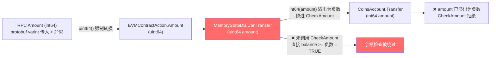

# EVM uint64→int64 溢出攻击分析

## 事件概述

- **日期**：2026-07-30
- **攻击交易**：`0xd288c03ead1296adcc50eb7be1824eab611a761920067734ff058c56cb262d74`
- **目标合约**：WBTY (Wrapped BTY) `0xe09f5bdca143f6e4ad9d43516a1d1289a3dd6dfc`
- **调用函数**：`deposit()` — `0xd0e30db0`
- **攻击结果**：攻击者以零成本铸造约 **184,467,398,737 WBTY**（约 1844.67 亿），随后 withdraw 部分兑成真 BTY 转走

## 攻击交易参数

```json
{
  "amount": "18446739873709551616",
  "gasLimit": "100000",
  "gasPrice": 1,
  "code": null,
  "para": "0xd0e30db0",
  "alias": "",
  "note": "f87b80...",
  "contractAddr": "0xe09f5bdca143f6e4ad9d43516a1d1289a3dd6dfc"
}
```

- `amount` = `18446739873709551616` ≈ 2^64（uint64 极值）
- `para` = `0xd0e30db0` = keccak256("deposit()")[:4]
- `note` = RLP 编码的以太坊格式交易（value 字段同样为 0x0de0b6b3a763f71b2ce97d8979c00000）

## 攻击链路

### 第一层：RPC 入口绕过 int64 限制

**文件**：`plugin/dapp/evm/rpc/rpc.go:68-80`

`EvmContractCallReq.Amount` 字段定义为 protobuf `int64`：

```go
// evmcontract.pb.go
type EvmContractCallReq struct {
    Amount int64 `protobuf:"varint,1,opt,name=amount,proto3"`
}
```

但 protobuf wire format 的 `int64` 使用**标准 unsigned varint 编码**（非 zigzag `sint64`），允许在线路上传入 > 2^63 的原始 uint64 值。Proto 库解码时：

```
解码值 = int64(18446739873709551616) = -4200000000000  // 溢出为负数
```

RPC 层随后 `uint64()` 强制转换恢复原值：

```go
amountInt64 := in.Amount                     // = -4200000000000 (int64)
Amount: uint64(amountInt64),                 // = 18446739873709551616 (uint64) ← 恢复！
```

### 第二层：余额检查被绕过

**文件**：`plugin/dapp/evm/executor/vm/state/statedb.go:441-453`

```go
func (mdb *MemoryStateDB) CanTransfer(sender string, amount uint64) bool {
    // ...
    return senderAcc.Balance >= int64(amount)   // int64(1.84e19) = -4200000000000
    //     balance >= 负数  →  永远为 TRUE ← 余额检查完全失效！
}
```

### 第三层：实际转账静默失败

**文件**：`plugin/dapp/evm/executor/vm/state/statedb.go:472-482`

```go
func (mdb *MemoryStateDB) Transfer(sender, recipient string, amount uint64) bool {
    value := int64(amount)  // value = -4200000000000
    if value < 0 {
        return false        // ← 转账未执行，攻击者零成本！
    }
    // ...
    ret, err = mdb.CoinsAccount.Transfer(sender, recipient, int64(amount))
}
```

### 第四层：EVM 无视 Transfer 返回值

**文件**：`plugin/dapp/evm/executor/vm/runtime/evm.go:233,257-262`

```go
func (evm *EVM) Call(caller ContractRef, addr common.Address, input []byte,
    gas uint64, value uint64) (...) {

    // preCheck 通过（因为 CanTransfer 被绕过）
    // Transfer 静默失败，但返回值被丢弃！
    evm.Transfer(evm.StateDB, caller.Address(), to.Address(), value)

    // 合约以原始 uint64 value 继续执行：
    var bigValue = new(big.Int).SetUint64(value)               // = 18446739873709551616
    if evm.CheckIsEthTx() && value != 0 {
        bigValue = evm.conversion2EthPrecision(bigValue)       // × 1e10 = 1.84e29
    }
    contract := NewContract(caller, AccountRef(addr), bigValue, gas)
    // msg.value = 1.84e29 → 合约凭空获得天量 value
}
```

### 第五层：WBTY 收到天量 msg.value

```solidity
// WBTY deposit() 伪代码
function deposit() public payable {
    balanceOf[msg.sender] += msg.value;  // += 1.84e29 (18 decimals)
    emit Deposit(msg.sender, msg.value); // → 显示 ~184,467,398,737 枚
}
```

### 精度计算验证

```
amount             = 18446739873709551616  (uint64, Chain33 1e8 精度)
bigValue           = 18446739873709551616 × 1e10 = 1.8447e29  (ETH 1e18 精度)
WBTY 余额 (18dec)  = 1.8447e29 / 1e18 = 184467398737.09552
Display value      ≈ 184,467,398,737  ← 与 Deposit 事件吻合
```

## 根因总结

| 层 | 文件 | 行号 | 问题 |
|----|------|------|------|
| **RPC** | `rpc/rpc.go` | 69,80 | `int64` Amount 通过 protobuf varint 可传入 > 2^63 值，`uint64()` 恢复大值 |
| **StateDB** | `state/statedb.go` | 453 | `CanTransfer`: `int64(amount)` 溢出为负数，余额校验恒成立 |
| **StateDB** | `state/statedb.go` | 479-481 | `Transfer`: `int64(amount)` 溢出为负数后 `value < 0` return false，转账未执行 |
| **EVM** | `vm/runtime/evm.go` | 233 | `evm.Transfer()` 返回值被丢弃，继续执行合约 |
| **EVM** | `vm/runtime/evm.go` | 257-262 | 合约以原始 `uint64` value 执行，mq.value 未受 Transfer 失败影响 |

**根本原因**：Chain33 底层 coins 系统使用 `int64` 承载金额，EVM 层以 `uint64` 传入（`uint64` 范围是 `int64` 的两倍）。在交叉边界上缺少溢出检测和返回值检查，导致 > max(int64) 的值可以绕过所有余额验证和实际转账，同时完整传递到 EVM 合约执行上下文。

## Chain33 底层现有防护机制

Chain33 账户系统（`chain33/account/`）自身已经具备完善的金额校验体系，但 EVM 层在调用前未复用这些校验。

### `types.CheckAmount` — 基础金额校验门禁

**文件**：`chain33/types/types.go:287`

```go
func CheckAmount(amount, coinPrecision int64) bool {
    if amount <= 0 || amount >= MaxCoin*coinPrecision {
        return false
    }
    return true
}
```

- `MaxCoin = 1e9`（约 10 亿 BTY）
- `coinPrecision = 1e8`（BTY 精度）
- 最大合法金额 = `1e9 × 1e8 = 1e17`

**关键设计**：`amount <= 0` 检查天然能捕获 `uint64 → int64` 溢出后的负数。正常情况下任何溢出值都会被拒绝。

### `account.DB.Transfer` — 完整的转账校验链

**文件**：`chain33/account/account.go:121`

```go
func (acc *DB) Transfer(from, to string, amount int64) (*types.Receipt, error) {
    if !acc.CheckAmount(amount) {             // 1. 金额范围校验
        return nil, types.ErrAmount
    }
    // ...
    if accFrom.GetBalance()-amount >= 0 {     // 2. 余额充足性检查
        accFrom.Balance = accFrom.GetBalance() - amount
        newBalance, _ := safeAdd(accTo.GetBalance(), amount)  // 3. 接收方溢出保护
        accTo.Balance = newBalance
    }
}
```

三层防护：
1. `CheckAmount` — 拒绝非法金额
2. 余额检查 — 拒绝超额转账
3. `safeAdd` — 拒绝接收方余额溢出（`balance + amount > MaxTokenBalance`）

### EVM 层如何绕过了这些防护



核心问题：`MemoryStateDB.CanTransfer()` 在调用链的中间层，直接比较 `balance >= int64(amount)` **绕过了** `account.DB.CheckAmount`。溢出发生在 `uint64 → int64` 这一步，此时 `amount` 已变成负数但余额比较式恒成立。

### 影响范围分析

此漏洞不只影响 WBTY，而是影响**所有依赖 `msg.value` 的 EVM 合约**：

| 影响类型 | 说明 |
|----------|------|
| **Wrapped Token (WETH/WBTY)** | deposit() 零成本铸造代币 |
| **Payable 合约** | 任意 payable 函数以天量 value 调用，余额检查失效 |
| **合约间调用** | `opCall` 中的 CALL 指令同样通过 `evm.Call()` 传递 value |
| **Token 预编译合约** | `token.go` 预编译 transfer 中 `amount.FromBytes().Int64()` 同样可溢出 |
| **跨链桥** | bridge 合约可能以超额 value 触发不正确的跨链事件 |

**根本影响**：EVM 以 `uint64` 暴露的金额接口，与 Chain33 底层的 `int64` 账户体系之间存在类型不匹配的架构缺陷，任何将 `uint64` 转为 `int64` 的位置都可能产生溢出。

---

从最底层到最外层，分层防御。

### 修复原则

Chain33 底层的 `types.CheckAmount(amount int64, coinPrecision int64)` 已有完善的金额校验逻辑（`amount <= 0` 或 `amount >= MaxCoin*precision` 返回 false），但 EVM 的 `MemoryStateDB` 在 `uint64 → int64` 转换时绕过了此校验。修复核心是在最底层转换点增加溢出防护。

### 第一层：`statedb.go` — `CanTransfer` 和 `Transfer` 增加溢出检查

**文件**：`plugin/dapp/evm/executor/vm/state/statedb.go`

这是 `uint64` 进入 chain33 `int64` 账户系统的边界，是最底层的防线。

**`CanTransfer`**：
```go
func (mdb *MemoryStateDB) CanTransfer(sender string, amount uint64) bool {
    // 新增：防止 uint64 → int64 溢出绕过余额检查
    if amount > math.MaxInt64 {
        return false
    }
    value := int64(amount)
    if value <= 0 {
        return false
    }
    // ... 原有逻辑使用安全的 value
}
```

**`Transfer`**：
```go
func (mdb *MemoryStateDB) Transfer(sender, recipient string, amount uint64) bool {
    // 新增：防止 uint64 → int64 溢出导致转账静默失败
    if amount > math.MaxInt64 {
        return false
    }
    value := int64(amount)
    // ... 原有 value < 0 检查保留
    // 同时将后续 int64(amount) 调用统一为 value
}
```

### 第二层：`evm.go` — `Call()` 和 `Create()` 检查 Transfer 返回值

**文件**：`plugin/dapp/evm/executor/vm/runtime/evm.go`

即使 `CanTransfer` 通过了，`Transfer` 仍可能因其他原因失败。本层检查返回值作为纵深防御。

**`Call()`**：
```go
if value > 0 && !evm.Transfer(evm.StateDB, caller.Address(), to.Address(), value) {
    evm.StateDB.RevertToSnapshot(snapshot)
    return nil, snapshot, gas, model.ErrInsufficientBalance
}
```

**`Create()`**：
```go
if value > 0 && !evm.Transfer(evm.StateDB, caller.Address(), contractAddr, value) {
    return nil, -1, gas, model.ErrInsufficientBalance
}
```

### 第三层：`rpc.go` — RPC 入口处校验 Amount 合法性

**文件**：`plugin/dapp/evm/rpc/rpc.go`

在 RPC 入口处预先校验 `int64` Amount 为正数，防止 protobuf varint 编码绕过限制。

**`CreateCallTx`**：
```go
if amountInt64 <= 0 {
    return nil, types.ErrAmount
}
```

**`CreateDeployTx`**：
```go
if amountInt64 < 0 {
    return nil, types.ErrAmount
}
```

**`CreateTransferOnlyTx`**：
```go
if in.Amount <= 0 {
    return nil, types.ErrAmount
}
```

### 举一反三：同类问题修复

审计过程中还发现并修复了同类溢出问题：

| 文件 | 问题 | 修复 |
|------|------|------|
| `token.go` | 预编译合约 transfer 中 `amount.Int64()` 可能从 uint256 溢出到 int64 | 增加 `amount.IsInt64()` 和 `v > 0` 检查 |
| `statedb.go:SubBalance` | SELFDESTRUCT 退款时 Transfer 返回值被丢弃 | 记录错误日志 |
| `statedb.go:AddBalance` | 同上 | 记录错误日志 |
| `exec.go:innerExec` | transfer-only 路径 Transfer 返回值被丢弃 | 检查返回值，失败时返回 `ErrNoBalance` |

### 防御层次总览

| 层 | 文件 | 防护机制 |
|----|------|----------|
| ③ RPC 入口 | `rpc/rpc.go` | 拒绝 `int64 <= 0` 的 Amount（阻止 protobuf varint 绕过） |
| ① 状态DB边界 | `state/statedb.go` | 拒绝 `uint64 > MaxInt64` 的金额（CanTransfer + Transfer + SubBalance + AddBalance） |
| ② EVM 执行 | `vm/runtime/evm.go` | 检查 Transfer 返回值，失败时回滚（Call + Create） |
| ② 执行器入口 | `exec.go` | transfer-only 路径检查 Transfer 返回值 |
| ① 预编译合约 | `token.go` | 拒绝 uint256 → int64 溢出的 transfer 金额 |
| - | `chain33/rpc/ethrpc/types/tx.go:AssembleChain33Tx` | `bigAmount.Int64()` + `uint64(amount)` 同类型溢出，已同步修复（`IsInt64` 检查 + nil 保护） |
